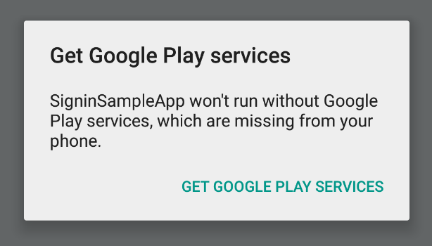

<p align="center">
  <a href="https://www.npmjs.com/package/@react-native-google-signin/google-signin"></a>
</p>

### 🚧🚧 Novas funcionalidades planejadas: procurando financiadores e colaboradores financeiros 🚧🚧

Veja este [issue](https://github.com/react-native-google-signin/google-signin/issues/942)

## Recursos

- Suporte para os 3 tipos de métodos de autenticação (padrão, com validação no lado do servidor ou com acesso offline (também conhecido como acesso no lado do servidor))
- API baseada em Promises consistente entre Android e iOS
- Tipagem para TypeScript e Flow
- Mock do módulo nativo para testes com Jest
- Botões nativos de login

## Requisitos

- RN >= 0.60

## Configuração e inicialização do projeto

`yarn add @react-native-google-signin/google-signin`

Em seguida, siga o guia [Android](docs/android-guide.md) e [iOS](docs/ios-guide.md)

## Instalação no Expo

> Este pacote não pode ser usado no aplicativo "Expo Go" porque [requer código nativo personalizado](https://docs.expo.io/workflow/customizing/). _No entanto, você pode adicionar código nativo personalizado ao Expo seguindo o guia abaixo._

```sh
npx expo install @react-native-google-signin/google-signin
```

Após instalar este pacote npm, adicione o [plugin de configuração](https://docs.expo.io/guides/config-plugins/) ao array [`plugins`](https://docs.expo.io/versions/latest/config/app/#plugins) do seu `app.json` ou `app.config.js`:

```json
{
  "expo": {
    "android": {
      "googleServicesFile": "./google-services.json"
    },
    "ios": {
      "googleServicesFile": "./GoogleService-Info.plist"
    },
    "plugins": ["@react-native-google-signin/google-signin"]
  }
}
```

Em seguida, reconstrua seu aplicativo conforme descrito no guia ["Adicionando código nativo personalizado"](https://docs.expo.io/workflow/customizing/).

## API Pública

### 1. GoogleSignin

```js
import {
  GoogleSignin,
  GoogleSigninButton,
  statusCodes,
} from '@react-native-google-signin/google-signin';
```

#### `configure(opções): void`

É obrigatório chamar este método antes de tentar chamar `signIn()` e `signInSilently()`. Este método é síncrono, o que significa que você pode chamar `signIn` / `signInSilently` logo em seguida. Em cenários típicos, `configure` precisa ser chamado apenas uma vez, após o início do seu aplicativo. Na camada nativa, esta é uma chamada síncrona. Todos os parâmetros são opcionais.

Exemplo de uso com opções padrão: você obtém o email do usuário e informações básicas do perfil.

```js
import { GoogleSignin } from '@react-native-google-signin/google-signin';

GoogleSignin.configure();
```

Um exemplo com todas as opções enumeradas:

```js
GoogleSignin.configure({
  scopes: ['https://www.googleapis.com/auth/drive.readonly'], // quais APIs você deseja acessar em nome do usuário, o padrão é email e perfil
  webClientId: '<DEVELOPER CONSOLE>', // ID do cliente do tipo WEB para o seu servidor (necessário para verificar o ID do usuário e acesso offline)
  offlineAccess: true, // se você deseja acessar a API do Google em nome do usuário DO SEU SERVIDOR
  hostedDomain: '', // especifica uma restrição de domínio hospedado
  forceCodeForRefreshToken: true, // [Android] relacionado ao `serverAuthCode`, leia a documentação do link abaixo *.
  accountName: '', // [Android] especifica um nome de conta no dispositivo a ser usado
  iosClientId: '<DEVELOPER CONSOLE>', // [iOS] se você quiser especificar o ID do cliente do tipo iOS (caso contrário, ele é obtido de GoogleService-Info.plist)
  googleServicePlistPath: '', // [iOS] se você renomeou seu arquivo GoogleService-Info, novo nome aqui, por exemplo, GoogleService-Info-Staging
  openIdRealm: '', // [iOS] O reino OpenID2 do servidor web doméstico. Isso permite que o Google inclua o Identificador OpenID do usuário no token de ID OpenID Connect.
  profileImageSize: 120, // [iOS] A altura (e largura) desejada da imagem do perfil. Padrão: 120px
});
```

\* [documentação forceCodeForRefreshToken](https://developers.google.com/android/reference/com/google/android/gms/auth/api/signin/GoogleSignInOptions.Builder#public-googlesigninoptions.builder-requestserverauthcode-string-serverclientid,-boolean-forcecodeforrefreshtoken)

#### `signIn(opções: { loginHint?: string })`

Abre um modal para permitir que o usuário faça login no seu aplicativo. A Promise resolvida retorna um objeto [`userInfo`](#3-userinfo). Rejeita com um erro caso contrário.

Opções: um objeto que contém uma única chave:

`loginHint`: [Somente iOS] O ID do usuário ou o endereço de e-mail do usuário, para ser pré-preenchido na interface de autenticação, se possível. [Veja a documentação aqui](<https://developers.google.com/identity/sign-in/ios/reference/Classes/GIDSignIn#/c:objc(cs)GIDSignIn(im)signInWithConfiguration:presentingViewController:hint:callback:>)

```js
// importe statusCodes junto com o GoogleSignin
import { GoogleSignin, statusCodes } from '@react-native-google-signin/google-signin';

// Em algum lugar do seu código
signIn = async () => {
  try {
    await GoogleSignin.hasPlayServices();
    const userInfo = await GoogleSignin.signIn();
    setState({ userInfo });
  } catch (error) {
    if (error.code === statusCodes.SIGN_IN_CANCELLED) {
      // o usuário cancelou o fluxo de login
    } else if (error.code === statusCodes.IN_PROGRESS) {
      // operação (por exemplo, login) já está em andamento
    } else if (error.code === statusCodes.PLAY_SERVICES_NOT_AVAILABLE) {
      // serviços do Google não disponíveis ou desatualizados
    } else {
      // algum outro erro ocorreu
    }
  }
};
```

#### `addScopes(opções: { scopes: Array<string> })`

Este método

 resolve com um objeto `userInfo` ou com `null` se nenhum usuário estiver logado no momento.

Você pode não precisar dessa chamada: você pode fornecer os escopos necessários para a chamada `configure`. No entanto, se você deseja acessar mais escopos posteriormente, use esta chamada.

Exemplo:

```js
const user = await GoogleSignin.addScopes({
  scopes: ['https://www.googleapis.com/auth/user.gender.read'],
});
```

#### `signInSilently()`

Pode ser chamado, por exemplo, após a montagem do seu componente principal. Este método retorna uma Promise que é resolvida com o [usuário atual](#3-userinfo) e rejeitada com um erro caso contrário.

Para saber como lidar com erros, leia o método [`signIn()`](#signinoptions--loginhint-string-).

```js
getCurrentUserInfo = async () => {
  try {
    const userInfo = await GoogleSignin.signInSilently();
    setState({ userInfo });
  } catch (error) {
    if (error.code === statusCodes.SIGN_IN_REQUIRED) {
      // o usuário ainda não fez login
    } else {
      // algum outro erro
    }
  }
};
```

#### `isSignedIn()`

Este método pode ser usado para verificar se algum usuário já fez login anteriormente. Ele retorna uma Promise que é resolvida com um valor booleano (nunca é rejeitada). Na camada nativa, esta é uma chamada síncrona e será resolvida mesmo quando o dispositivo estiver offline.

Observe que `isSignedIn()` pode retornar true, mas `getCurrentUser()` pode retornar `null`, nesse caso, você pode chamar `signInSilently()` para recuperar o usuário. No entanto, pode acontecer que a chamada `signInSilently()` seja rejeitada com um erro (por exemplo, devido a um problema de rede).

```js
isSignedIn = async () => {
  const isSignedIn = await GoogleSignin.isSignedIn();
  setState({ isLoginScreenPresented: !isSignedIn });
};
```

#### `getCurrentUser()`

Este método resolve com `null` ou um objeto `userInfo` do usuário atualmente logado. A chamada nunca é rejeitada e, na camada nativa, esta é uma chamada síncrona.

```js
getCurrentUser = async () => {
  const currentUser = await GoogleSignin.getCurrentUser();
  setState({ currentUser });
};
```

#### `clearCachedAccessToken(accessTokenString)`

Este método só tem efeito no Android. Você pode encontrar um erro `401 Unauthorized` quando um token for inválido. Chame este método para remover o token do cache local e, em seguida, chame `getTokens()` para obter tokens atualizados. Chamar este método no iOS não faz nada e sempre resolve. Isso ocorre porque no iOS, `getTokens()` sempre retorna tokens válidos, atualizando-os primeiro se eles expirarem ou estiverem prestes a expirar (consulte a [documentação](https://developers.google.com/identity/sign-in/ios/reference/Classes/GIDGoogleUser#-refreshtokensifneededwithcompletion:)).

#### `getTokens()`

Resolve com um objeto contendo `{ idToken: string, accessToken: string }` ou rejeita com um erro. Observe que usar `accessToken` para verificação de identidade em seu servidor backend é [desencorajado](https://developers.google.com/identity/sign-in/android/migration-guide).

#### `signOut()`

Faz logout do usuário atual.

```js
signOut = async () => {
  try {
    await GoogleSignin.signOut();
    setState({ user: null }); // Lembre-se de remover o usuário também do estado do seu aplicativo
  } catch (error) {
    console.error(error);
  }
};
```

#### `revokeAccess()`

Remove seu aplicativo das aplicações autorizadas do usuário. Leia mais sobre isso [aqui](https://developers.google.com/identity/sign-in/ios/disconnect#objective-c) e [aqui](<https://developers.google.com/android/reference/com/google/android/gms/auth/api/signin/GoogleSignInClient#revokeAccess()>).

```js
revokeAccess = async () => {
  try {
    await GoogleSignin.revokeAccess();
    // Conta do Google desconectada do seu aplicativo.
    // Execute ações de limpeza, como excluir dados associados à conta desconectada.
  } catch (error) {
    console.error(error);
  }
};
```

#### `hasPlayServices(opções)`

Verifica se o dispositivo possui o Google Play Services instalado. Sempre resolve como verdadeiro no iOS.

A presença do Google Play Services atualizado é necessária para mostrar o modal de login, mas não é necessário para chamar as funções `configure` e `signInSilently`. Portanto, recomendamos chamar `hasPlayServices` diretamente antes de `signIn`.

```js
try {
  await GoogleSignin.hasPlayServices({ showPlayServicesUpdateDialog: true });
  // serviços do Google estão disponíveis
} catch (err) {
  console.error('os serviços do Google não estão disponíveis');
}
```

`hasPlayServices` aceita um parâmetro, um objeto que contém uma única chave: `showPlayServicesUpdateDialog` (padrão: `true`). Quando `showPlayServicesUpdateDialog` é definido como true, a biblioteca solicitará ao usuário que tome medidas para resolver o problema, como mostrado na figura abaixo.

Você também pode usar esta chamada a qualquer momento para verificar se o Google Play Services está disponível e reagir ao resultado conforme necessário.

[](#prompt-install)

#### `statusCodes`

Esses valores são úteis ao determinar qual tipo de erro ocorreu durante o processo de login. Importe `statusCodes` junto com `GoogleSignIn`. Sob o capô, essas constantes são derivadas dos códigos de erro nativos do GoogleSignIn e são específicas da plataforma. Sempre prefira comparar `error.code` com `statusCodes.SIGN_IN_CANCELLED` ou `statusCodes.IN_PROGRESS` e não confiar no valor bruto de `error.code`.

| Nome                          | Descrição                                                                                                                                                                                                                                                                                                                                                                                         |
| ----------------------------- | --------------------------------------------------------------------------------------------------------------------------------------------------------------------------------------------------------------------------------------------------------------------------------------------------------------------------------------------------------------------------------------------------- |
| `SIGN_IN_CANCELLED`           | Quando o usuário cancela o fluxo de login                                                                                                                                                                                                                                                                                                                                                          |
| `IN_PROGRESS`                 | Tentativa de invocar outra operação (por exemplo, `signInSilently`) quando a operação anterior ainda não foi concluída. Se você chamar, por exemplo, `signInSilently` duas vezes, serão feitas 2 chamadas para `signInSilently` no módulo nativo. A promise da primeira chamada de `signInSilently` será rejeitada com esse erro e a segunda resolverá / rejeitará com o resultado do módulo nativo. |
| `SIGN_IN_REQUIRED`            |

 Útil ao usar `signInSilently()` - nenhum usuário fez login ainda                                                                                                                                                                                                                                                                                                                                   |
| `PLAY_SERVICES_NOT_AVAILABLE` | Os serviços do Play não estão disponíveis ou desatualizados, isso só pode acontecer no Android                                                                                                                                                                                                                                                                                                     |

[Exemplo de como usar `statusCodes`](#signinoptions--loginhint-string-).

### 2. GoogleSigninButton


```js
import { GoogleSignin, GoogleSigninButton } from '@react-native-google-signin/google-signin';

<GoogleSigninButton
  size={GoogleSigninButton.Size.Wide}
  color={GoogleSigninButton.Color.Dark}
  onPress={this._signIn}
  disabled={this.state.isSigninInProgress}
/>;
```

#### Propriedades

##### `size`

Valores possíveis:

- Size.Icon: mostra apenas o ícone do Google. Tamanho recomendado de 48 x 48.
- Size.Standard: ícone com 'Entrar'. Tamanho recomendado de 230 x 48.
- Size.Wide: ícone com 'Entrar com o Google'. Tamanho recomendado de 312 x 48.

Padrão: `Size.Standard`. Dado o `size` prop que você passa, nós aplicaremos automaticamente o tamanho recomendado, mas você pode substituí-lo passando a propriedade de estilo como em `style={{ width, height }}`.

##### `color`

Valores possíveis:

- Color.Dark: aplica um fundo azul
- Color.Light: aplica um fundo cinza claro

##### `disabled`

Booleano. Se verdadeiro, todas as interações com o botão são desabilitadas.

##### `onPress`

Manipulador a ser chamado quando o usuário tocar no botão

##### [Propriedades `View` herdadas...](https://facebook.github.io/react-native/docs/view#props)

### 3. `userInfo`

Exemplo de `userInfo` que é retornado após o login bem-sucedido.

```
{
  idToken: string,
  serverAuthCode: string,
  scopes: Array<string>,
  user: {
    email: string,
    id: string,
    givenName: string,
    familyName: string,
    photo: string, // url
    name: string // nome completo
  }
}
```

## Mock do módulo Jest

Se você usa o Jest para testes, pode precisar simular a funcionalidade do módulo nativo. Esta biblioteca vem com um mock do Jest que você pode adicionar ao array `setupFiles` na configuração do Jest.

Por padrão, o mock se comporta como se as chamadas fossem bem-sucedidas e retorna dados do usuário falsos.

```
"setupFiles": [
 "./node_modules/@react-native-google-signin/google-signin/jest/build/setup.js"
],
```

## Quer contribuir?

Confira o [guia do contribuidor](CONTRIBUTING.md)!

## Observações

Chamar os métodos expostos por este pacote pode envolver chamadas de rede remotas e você deve levar em conta que essas chamadas podem levar muito tempo para serem concluídas (por exemplo, em caso de conexão de rede fraca).

**Observação do idToken**: o idToken não é nulo apenas se você especificar um `webClientId` válido. `webClientId` corresponde ao ID do cliente do seu servidor no console de desenvolvedores. Ele **DEVE SER** do tipo **WEB**

Leia a [documentação do iOS](https://developers.google.com/identity/sign-in/ios/backend-auth) e [documentação do Android](https://developers.google.com/identity/sign-in/android/backend-auth) para obter mais informações.

**Observação do serverAuthCode**: o serverAuthCode não é nulo apenas se você especificar um `webClientId` válido e definir `offlineAccess` como true. Depois de obter o código de autenticação, você pode enviá-lo para seu servidor backend e trocar o código por um token de acesso. Somente com esse token recém-adquirido você pode acessar os dados do usuário.

Leia a [documentação do iOS](https://developers.google.com/identity/sign-in/ios/offline-access) e [documentação do Android](https://developers.google.com/identity/sign-in/android/offline-access) para obter mais informações.

## Escopos adicionais

Os escopos solicitados por padrão são `email` e `profile`.

Se você deseja gerenciar outros dados do seu aplicativo (por exemplo, acessar a agenda do usuário ou fazer upload de um arquivo para o Google Drive), você precisa solicitar permissões adicionais. Isso pode ser feito adicionando os escopos necessários ao configurar a instância do GoogleSignin.

Consulte https://developers.google.com/identity/protocols/googlescopes ou https://developers.google.com/oauthplayground/ para obter uma lista de escopos disponíveis.

## Solução de problemas

Consulte a seção de solução de problemas no [guia Android](docs/android-guide.md) e [guia iOS](docs/ios-guide.md).

## Licença

(MIT)
